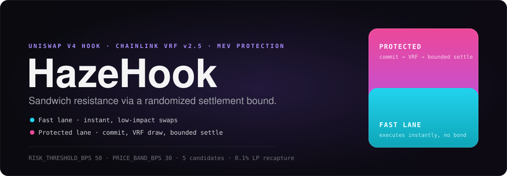
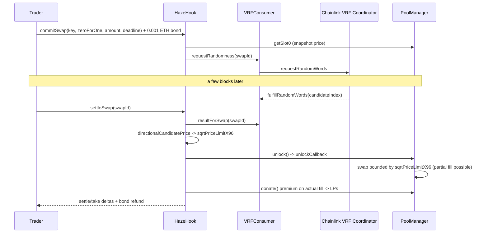

<p align="center">
  
</p>

**A Uniswap v4 hook that makes sandwich attacks harder to size precisely — not by hiding trades, by making their exact execution price unknown until settlement.**

> A sandwich bot needs to know, before it acts, how much slippage room your trade will actually use. Haze doesn't let it find out until after your trade is already queued.

**Not a fixed-slippage guard or a bigger fee** — Haze splits risky swaps into a **commit**, where the trade's intent is locked and a Chainlink VRF request is fired, and a **settle**, where the swap executes bounded by one of five price limits picked at random *after* commit. Small, low-impact trades never touch this — they execute instantly, exactly like a normal v4 swap.

Haze is a single hook (`src/HazeHook.sol`) plus a Chainlink VRF v2.5 adapter (`src/VRFConsumer.sol`). Every high-impact swap is forced through commit/settle; the swap itself is bounded by a `sqrtPriceLimitX96` drawn from 5 candidates after commit, so how much of the trade actually fills isn't knowable in advance. A 0.1% premium on protected fills is routed straight to LPs via `PoolManager.donate()` — the same accounting real swap fees use, no separate claims contract.


| | |
|---|---|
| **Live hook** | [`0xdE8563cd71256d980AB37c7DeD90671915d30080`](https://sepolia.etherscan.io/address/0xdE8563cd71256d980AB37c7DeD90671915d30080) · Sepolia (11155111) |
| **VRF adapter** | [`0x978ac30c2adF302E86b3815A6d165F2893aF4CE5`](https://sepolia.etherscan.io/address/0x978ac30c2adF302E86b3815A6d165F2893aF4CE5) · Chainlink VRF v2.5 |
| **Tests** | 47 passing (Foundry) — `forge test` — 99% lines / 97% branches on the hook, 100% lines / 80% branches on the VRF adapter |
| **Frontend** | `frontend/` — Next.js + RainbowKit + wagmi/viem, real fast-lane execution, commit/settle flow with live VRF status, LP recapture stats, add-liquidity — run locally, no hosted deploy yet |

---

## How it works

### 1. Risk classification (`estimatedImpactBps`, `_beforeSwap`)

Every swap through the pool is classified by estimated price impact, computed with the same `SqrtPriceMath` the pool itself swaps with — not a naive amount/liquidity ratio. If a swap (in either exact-input *or* exact-output form — see the fix note below) would move price by more than `RISK_THRESHOLD_BPS` (50 bps), `_beforeSwap` reverts it with `ProtectedSwapRequired`, forcing it through `commitSwap`/`settleSwap` instead. Below that, it's not worth attacking anyway — it executes immediately, no different from a plain v4 swap.

### 2. Commit — bonded, not free (`commitSwap`)

`commitSwap` snapshots the live pool price, requests randomness from the VRF adapter, and records the intent. It also requires a **0.001 ETH bond** (`COMMIT_BOND`) as `msg.value`.


### 3. Settle — a bound, not a target (`settleSwap`, `directionalCandidatePrice`)

Once the VRF result lands, `settleSwap` picks one of `NUM_CANDIDATES` (5) prices, evenly spaced across `PRICE_BAND_BPS`, and calls `PoolManager.swap` with that price as `sqrtPriceLimitX96`. Because `directionalCandidatePrice` applies its distance to `sqrtPriceX96` directly rather than to the real price (price = sqrtPrice²), the 5 candidates work out to **real price-bps limits of 12/24/36/48/60**. `PRICE_BAND_BPS` is 30 specifically so the widest candidate (60 bps) clears `RISK_THRESHOLD_BPS` (50 bps).


### 4. LP recapture (`_recapturePremiumToLPs`)

A `PROTECTED_LANE_FEE_PREMIUM_BPS` (10 bps) premium is charged on the *actually filled* amount — not the originally committed amount, since a partial fill would otherwise overcharge — and routed to in-range LPs via `PoolManager.donate()`. This credits directly into the pool's `feeGrowthGlobal` accounting, the same mechanism ordinary swap fees use, so it pays out proportional to liquidity share with no separate distribution contract to build or trust.

### 5. Bond auto-refund (`_refundBond`, `withdrawBond`)

`settleSwap` and `cancelExpiredSwap` push the bond straight back to the trader (a bounded 30,000-gas transfer) no separate claim transaction for a normal wallet. If that push fails (a contract wallet with a reverting or gas-hungry `receive()`), the bond is credited to `unclaimedBond` instead of reverting the trade, and `withdrawBond()` recovers it later a broken refund can never brick the trader's own settlement.

---

## Partner integrations

**Chainlink VRF v2.5** is the only external partner integration in this project. it's what the entire "randomized settlement" mechanism is built on. Exact locations:

| What | Where |
|---|---|
| The adapter contract itself | `src/VRFConsumer.sol` — extends `VRFConsumerBaseV2Plus` ([line 4](src/VRFConsumer.sol#L4), [line 10](src/VRFConsumer.sol#L10)) |
| Requesting randomness from the coordinator | `src/VRFConsumer.sol` — `requestRandomWords` call ([line 60](src/VRFConsumer.sol#L60)) |
| Receiving the result | `src/VRFConsumer.sol` — `fulfillRandomWords` callback ([line 83](src/VRFConsumer.sol#L83)), called by Chainlink's coordinator, not by this project |
| The hook's side of the integration | `src/HazeHook.sol` — the `ISwapRandomnessConsumer` interface ([line 15](src/HazeHook.sol#L15)), the hook's reference to it ([line 95](src/HazeHook.sol#L95)), the request call inside `commitSwap` ([line 203](src/HazeHook.sol#L203)), the result read inside `settleSwap` ([line 286](src/HazeHook.sol#L286)) |
| Wiring to the real coordinator/subscription/key hash | `script/RedeployHook.s.sol` |

Verifiable independently of this repo: the live subscription's real request/fulfillment history is visible on [Chainlink's own VRF dashboard](https://vrf.chain.link/sepolia/46997927598943781172806036110123563029699671687926566697681699947473240716140), and every fulfillment transaction on [Sepolia Etherscan](https://sepolia.etherscan.io/address/0x978ac30c2adF302E86b3815A6d165F2893aF4CE5#events) is sent by Chainlink's coordinator contract, not by this project's own wallets — proof the randomness is genuinely external, not self-rolled.

---

## Architecture



| Contract | Role |
|---|---|
| `HazeHook` | The hook itself — risk classification, commit/settle state machine, bond escrow, LP recapture |
| `VRFConsumer` | Chainlink VRF v2.5 adapter — gated so only the hook can request randomness (`NotHook`), owner-configurable callback gas/confirmations |
| Sepolia `PoolManager` | Canonical v4 core — all actual swap/donate logic runs through its `unlock` callback |
| HTT (MockERC20) | Free-mint test token — deliberately open `mint()`, since WETH is the real capital constraint on testnet |
| Sepolia WETH | Real Sepolia WETH — the pool's other leg |

---

## Live deployment

| Contract | Address |
|---|---|
| **HazeHook** | [`0xdE8563cd71256d980AB37c7DeD90671915d30080`](https://sepolia.etherscan.io/address/0xdE8563cd71256d980AB37c7DeD90671915d30080) |
| **VRFConsumer** | [`0x978ac30c2adF302E86b3815A6d165F2893aF4CE5`](https://sepolia.etherscan.io/address/0x978ac30c2adF302E86b3815A6d165F2893aF4CE5) |
| Pool | HTT/WETH, fee 500 (0.05%), tick spacing 10, 1 WETH ≈ 10,000 HTT starting price |
| Test token (HTT) | [`0xDE8A1613Ee95a0Ee72fF5B72Af2aAdFe6C783F3D`](https://sepolia.etherscan.io/address/0xDE8A1613Ee95a0Ee72fF5B72Af2aAdFe6C783F3D) |
| Sepolia WETH | [`0xfFf9976782d46CC05630D1f6eBAb18b2324d6B14`](https://sepolia.etherscan.io/address/0xfFf9976782d46CC05630D1f6eBAb18b2324d6B14) |
| PoolManager | [`0xE03A1074c86CFeDd5C142C4F04F1a1536e203543`](https://sepolia.etherscan.io/address/0xE03A1074c86CFeDd5C142C4F04F1a1536e203543) |
| PositionManager | [`0x429ba70129df741B2Ca2a85BC3A2a3328e5c09b4`](https://sepolia.etherscan.io/address/0x429ba70129df741B2Ca2a85BC3A2a3328e5c09b4) |
| V4 Quoter | [`0x61B3f2011A92d183C7dbaDBdA940a7555Ccf9227`](https://sepolia.etherscan.io/address/0x61B3f2011A92d183C7dbaDBdA940a7555Ccf9227) |
| V4 Router | [`0xf13D190e9117920c703d79B5F33732e10049b115`](https://sepolia.etherscan.io/address/0xf13D190e9117920c703d79B5F33732e10049b115) |
| Chainlink VRF Coordinator | [`0x9DdfaCa8183c41ad55329BdeeD9F6A8d53168B1B`](https://sepolia.etherscan.io/address/0x9DdfaCa8183c41ad55329BdeeD9F6A8d53168B1B) |

---

## Build, test & deploy

### Quickstart

```bash
cd haze-hook
forge install       # forge-std, v4-template, chainlink-brownie-contracts
forge build          # solc 0.8.26
forge test           # 47 tests, 3 suites — all pass
forge coverage --report summary
```

Foundry's newer lint pass can't resolve a bare `test/utils/Deployers.sol` import inside v4-template's own `BaseScript.sol` (the real compiler resolves it fine relative to v4-template's package root) — `[lint] lint_on_build = false` in `foundry.toml` works around it, matching v4-template's own config.

### Deploy runbook

All scripts live in `script/`, use `HookMiner` to mine a CREATE2 address matching the hook's permission flags (`beforeSwap` only), and broadcast via a named Foundry keystore account rather than a raw private key.

| Script | What it does |
|---|---|
| `RedeployHook.s.sol` | Deploys a new `HazeHook`, reusing an already-funded `VRFConsumer` (repoints it via `setHook` — avoids re-registering a new consumer with the VRF subscription) |
| `RedeployPool.s.sol` | Initializes the HTT/WETH pool at a deliberately lopsided 1:10,000 starting price and seeds liquidity, pointed at whatever hook `RedeployHook.s.sol` most recently deployed |

The very first deployment used two now-deleted scripts, `DeployHook.s.sol` + `DeployLopsidedPool.s.sol` (deploying a fresh `VRFConsumer` + hook pair, since there was no existing one to reuse yet — see `broadcast/` for that history); every redeploy since reuses the `Redeploy*` scripts above instead.

```bash
forge script script/RedeployHook.s.sol \
  --rpc-url <sepolia_rpc> --account <keystore_name> --broadcast

forge script script/RedeployPool.s.sol \
  --rpc-url <sepolia_rpc> --account <keystore_name> --broadcast
```

### Frontend

```bash
cd frontend
npm install
npm run dev      # http://localhost:3000
```

Next.js (Pages Router) + RainbowKit + wagmi/viem. Reads pool price/liquidity via direct `extsload` storage reads on `PoolManager` (no separate StateView deployment needed); the fast lane executes real swaps through Sepolia's canonical V4 Router; the protected lane drives the full commit → wait-on-VRF → settle flow with a live countdown and cancel-if-expired path. `/pool` shows LP recapture stats (scanned from `PremiumRecaptured` events) and an add-liquidity form.

---

## Security & trust assumptions

Hackathon-scope code — **not audited, testnet only, do not deploy with real funds without a proper review.**

- **This does not fully solve sandwich attacks — it narrows the window.** `commitSwap` reveals nothing executable yet. But the base price at commit time is public, and the candidate-price formula is public code, so an attacker can compute all 5 possible boundaries immediately — they just don't know which wins, so they're reduced to an expected-value play across a known 5-way distribution rather than a certain one. More importantly: once `settleSwap` is broadcast, the *exact* boundary is sitting in public calldata before it's mined — the actual value-moving swap is, at that moment, just as sandwichable as any ordinary bounded swap. **The real fix for that specific gap is submitting `settleSwap` through a private relay** (e.g. Flashbots Protect) in production; this isn't demonstrable on Sepolia since there's no real economic incentive for an adversary to attack testnet transactions in the first place.
- **Reentrancy.** `settleSwap` sets `pending.settled = true` *before* the external `poolManager.unlock()` call (checks-effects-interactions) — an earlier version set it after, leaving a window where a malicious token's transfer hooks could re-enter and double-settle. `unlockCallback` is gated `onlyPoolManager`.
- **VRF request spam.** Closed via the commit bond (see [above](#2-commit--bonded-not-free-commitswap)) — commitSwap previously had no economic cost, only a risk-threshold check that any caller could clear for free with a fabricated `amountSpecified`.
- **Admin key.** `VRFConsumer.setHook`/`setCallbackConfig` sit behind a single EOA owner (`Ownable`, from `VRFConsumerBaseV2Plus`) — fine for a testnet demo, a real production deployment needs a timelock or multisig here.
- **Token custody gap, documented not hidden.** `commitSwap` doesn't check the trader's balance/allowance up front — `settleSwap` simply reverts at the transfer step if it's missing. A trader needs to have approved the hook for the input token before committing.
- **Impact estimation is deliberately conservative.** `estimatedImpactBps` ignores tick-crossing beyond the current tick's liquidity, which under-estimates real impact for large trades — meaning the classifier's error, when it errs, routes a trade to the protected lane a full simulation would've called safe, not the reverse.

## Limitations & future work

- **Partial fills are expected, not a bug — and they're a real UX cost.** Because `sqrtPriceLimitX96` bounds the trade rather than targeting a price, and the price band is deliberately narrower than the risk threshold that triggers protection, a large protected-lane trade routinely needs 2-3 commit/settle rounds to fill meaningfully. The honest fix is true price-targeting (derive `amountSpecified` from the chosen candidate price via `SqrtPriceMath`, executing fully at that price instead of up to a boundary) — a documented next step, not yet built, because it doesn't solve "fill my whole large request" either (the candidate band is still narrow relative to a genuinely large trade) — it trades discovering the fill amount by hitting a wall for computing it up front.
- **`settleSwap` mempool visibility** — see [Security](#security--trust-assumptions) above; needs a private relay in production.
- **Single admin key on `VRFConsumer`** — needs a multisig/timelock for anything beyond a demo.
- **Threshold/band tuning is a live parameter, not a solved one.** `RISK_THRESHOLD_BPS`/`PRICE_BAND_BPS` trade off fill completeness against worst-case settle-time price concession; current values (50/30) were chosen so a threshold-sized trade can fully fill on a lucky draw without making the randomization a formality.
- **Compared to batch-auction systems** (CoW Protocol) or time-spread execution (TWAMM), this trades a stronger protection guarantee for a simpler, fully on-chain, single-contract mechanism — worth stating plainly rather than implying equivalence.

---

## Repo layout

```
src/
  HazeHook.sol           # the hook: risk classification, commit/settle, bond escrow, LP recapture
  VRFConsumer.sol        # Chainlink VRF v2.5 adapter
script/
  RedeployHook.s.sol  # hook (+ consumer) deployment
  RedeployPool.s.sol  # pool init + liquidity seeding
test/
  HazeHook.t.sol             # unit tests against a mocked PoolManager
  HazeHookIntegration.t.sol  # integration tests against a real v4 PoolManager
  VRFConsumer.t.sol          # unit tests against VRFCoordinatorV2_5Mock
frontend/
  src/pages/     # /, /swap, /pool, /about
  src/components/  # SwapWidget, BalancesPanel, AddLiquidityForm, RecaptureStats
  src/lib/       # contracts.ts — addresses, ABIs, on-chain math helpers
hook-architecture.md   # the original design doc this was built from
```

---

## License

MIT — see [`LICENSE`](LICENSE). Built on the [Uniswap v4 Hook Template](https://github.com/Uniswap/v4-template) (also MIT).
